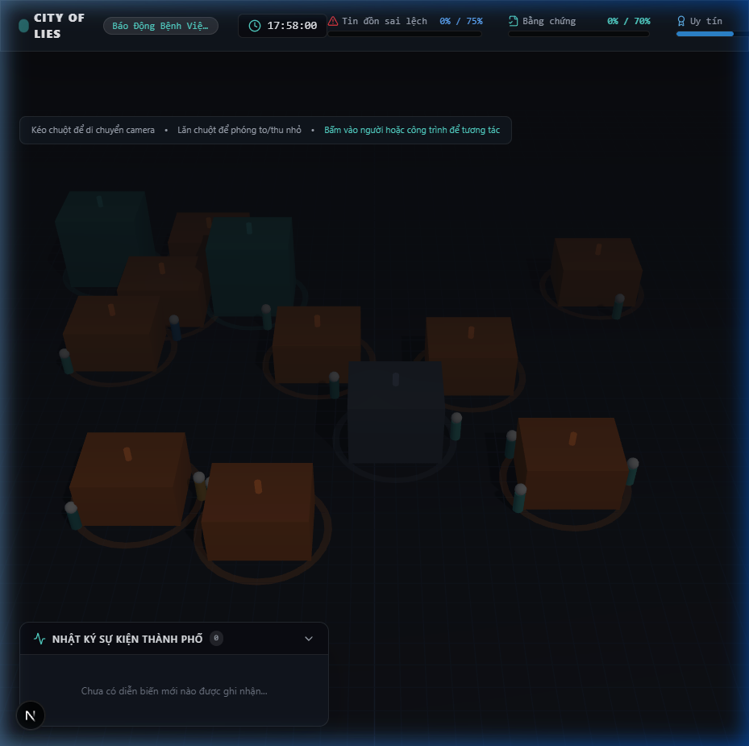
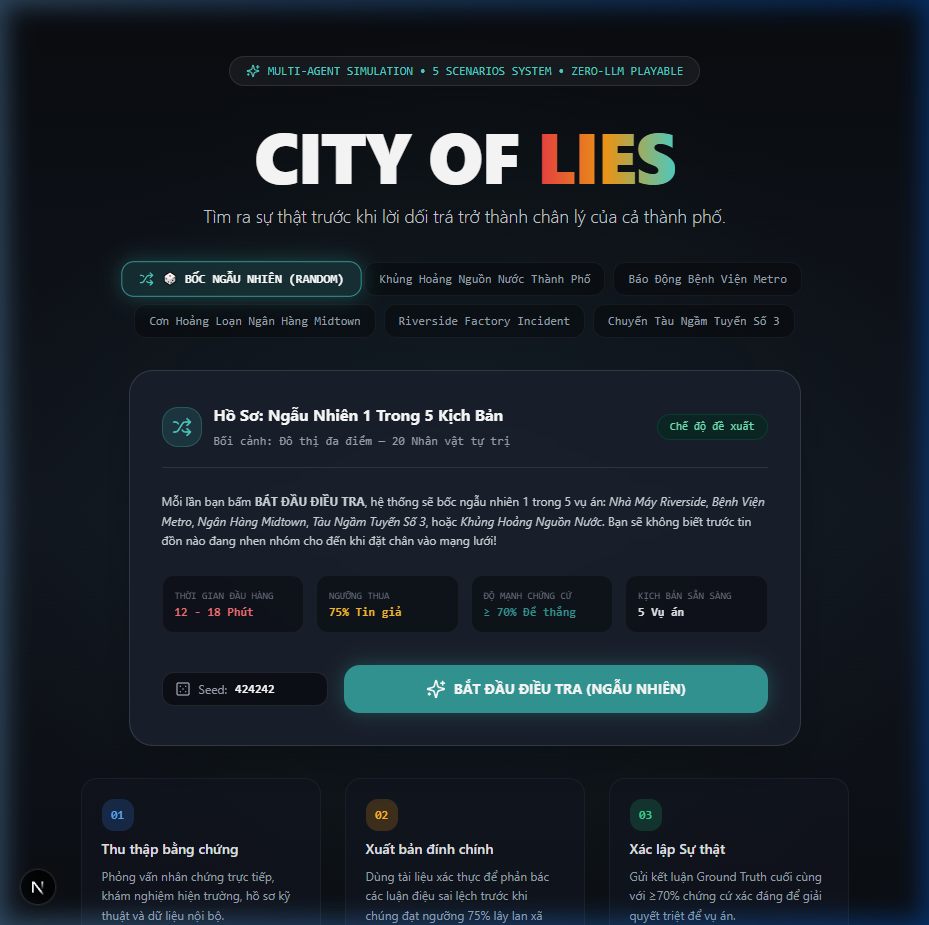
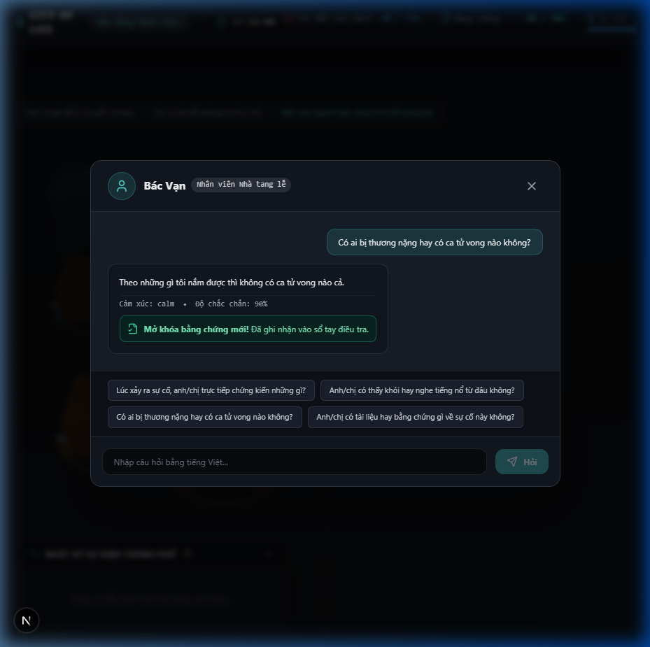
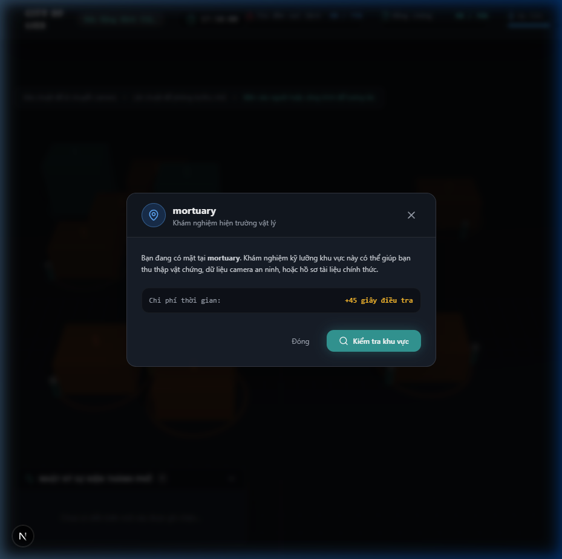
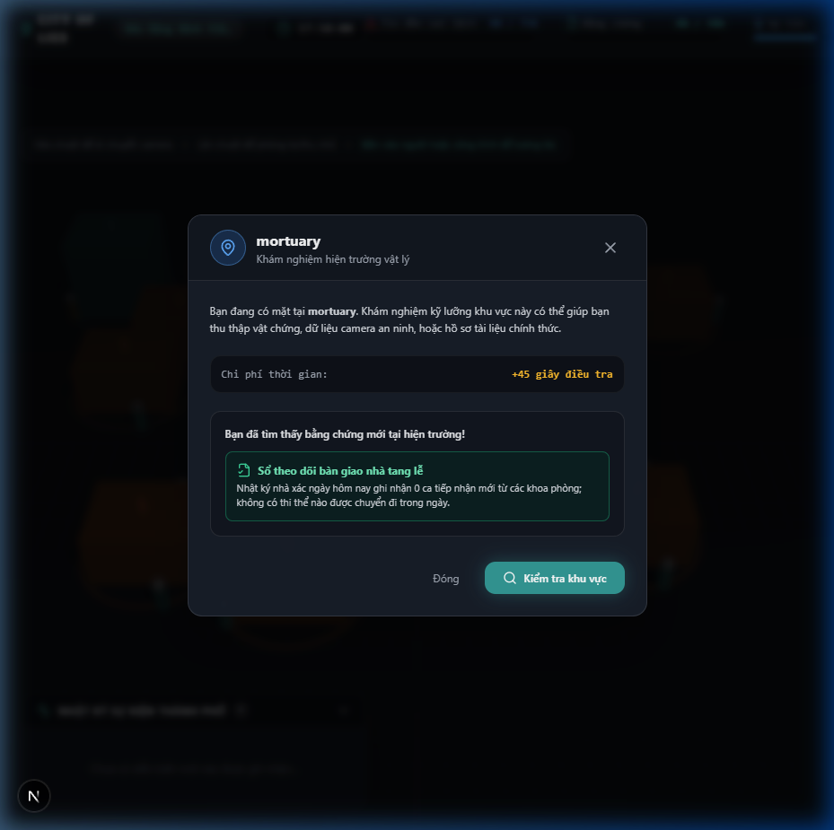

# City of Lies

> **City of Lies is a browser-based real-time multi-agent simulation in which autonomous characters form and propagate beliefs from partial observations, social trust and memory. Players investigate the same event and must establish the evidence-backed Ground Truth before a false narrative reaches social dominance.**

---

## 🔍 Core Concept

At approximately 17:58, an electrical fault in distribution panel DB-4 triggers a localized fire in the storage facility of Riverside Factory. There are no fatalities and no hazardous chemical release. However, as 20 distinct autonomous characters converse, misinterpret fragments, and share sensational rumors across the district, a dangerous false narrative emerges:

> *"A chemical explosion happened at Riverside Factory. Several workers died, and management is hiding the real casualty count."*

As the player, an independent investigator, you must interview witnesses, inspect locations, gather verified documentary and physical evidence, publish targeted corrections to curb misinformation, and submit the atomic Ground Truth before the primary false narrative reaches the **75% social dominance threshold**.

---

## 🛠️ Architecture & Technology Stack

- **Backend**: Go (Go 1.27) modular monolith, `net/http` + `go-chi/chi/v5`, `github.com/coder/websocket` for real-time WebSocket transport.
- **Database**: PostgreSQL 18 with `pgx/v5` connection pool and type-safe `sqlc` query generation.
- **Simulation**: Authoritative deterministic simulation engine with seeded RNG, provenance-tracked belief propagation, and weighted narrative metrics.
- **Frontend**: Next.js 16 (React 19, TypeScript strict), Three.js / React Three Fiber 9.x for 3D isometric district visualization, Zustand state management, Tailwind CSS.
- **LLM Safety Layer**: Zero LLM hallucination in game state. LLM controls only dialogue expression, bound by a strict Knowledge Guard. The simulation is 100% deterministic and fully playable even with LLM disabled.

---

## 📸 Gameplay & Interface Gallery

| 🏙️ 3D Isometric District Simulation | 🎭 Dynamic Scenario Selection |
|:---:|:---:|
|  |  |

| 💬 NPC Dialogue & KnowledgeGuard | 🔍 Location Inspection & Scene Analysis |
|:---:|:---:|
|  |  |

| 📂 Evidence Discovery & Forensic Chain of Custody |
|:---:|
|  |

---

## 🚀 Quick Start

### Prerequisites
- Go 1.27+
- Node.js 20+ / npm 10+
- Docker & Docker Compose (for PostgreSQL)

### 1. Run with Docker Compose
```bash
docker compose up --build
```
Open `http://localhost:3000` to start investigating.

### 2. Local Development
```bash
# Start PostgreSQL
docker compose -f docker-compose.dev.yml up -d

# Run Backend
cd backend
go run ./cmd/api

# Run Frontend
cd frontend
npm install
npm run dev
```

### 3. Headless Simulation Engine
Run the simulation engine without web UI to simulate rumor propagation:
```bash
cd backend
go run ./cmd/sim
```

### 4. Scenario Validation
Verify scenario integrity and referential constraints across all 5 built-in scenarios:
```bash
cd backend
go run ./cmd/scenario-check ../data/scenarios/riverside-factory
go run ./cmd/scenario-check ../data/scenarios/metro-hospital-outbreak
go run ./cmd/scenario-check ../data/scenarios/midtown-bank-run
go run ./cmd/scenario-check ../data/scenarios/subway-line3-standstill
go run ./cmd/scenario-check ../data/scenarios/city-water-panic
```

### 5. Automated Soak Testing (100 Seeds)
Validate that rumor propagation and social defeat ratios are balanced (>90% defeat rate without player intervention):
```bash
# PowerShell
.\scripts\soak-test.ps1 -Runs 10 -Scenario data/scenarios/metro-hospital-outbreak

# Bash
./scripts/soak-test.sh 10 10 ../data/scenarios/riverside-factory
```

---

## 🎭 Scenarios

| Scenario ID | Title | Core Incident | Primary Misinformation |
|---|---|---|---|
| `riverside-factory` | **Riverside Factory Incident** | Electrical fault fire in storage DB-4 | Chemical explosion, fatalities & management coverup |
| `metro-hospital-outbreak` | **Metro Hospital Outbreak** | Canteen tuna histamine food poisoning | Biohazard virus leak & secret quarantine |
| `midtown-bank-run` | **Midtown Bank Run** | Core banking patch deadlock & ATM glitch | Bank insolvency, frozen accounts & CEO fleeing with gold |
| `subway-line3-standstill` | **Subway Line 3 Standstill** | Track signal short circuit auto-brake | Terrorist nerve gas attack & mass suffocation |
| `city-water-panic` | **City Water Panic** | Pressure valve gasket rupture sediment surge | Cyanide poisoning & citywide water shutdown |

---

## 🤖 LLM Dialogue Integration & Knowledge Guard

City of Lies features an innovative AI architecture that strictly separates simulation state from dialogue expression:

1. **Zero Hallucination Guarantee**: Game state (beliefs, relationships, clues, social ratio) is 100% authoritative and governed by pure Go math. LLMs only format conversational responses.
2. **`KnowledgeGuard` Safety Filter**: Every utterance generated by an external LLM is intercepted and validated against the NPC's known beliefs:
   - Rejects any claims not currently known to the character.
   - Forbids leaking unauthorized evidence or server ground truth.
   - Enforces intent, emotion, and Vietnamese speech authenticity.
3. **Graceful Fallback**: If an LLM call fails, times out, or is rejected by `KnowledgeGuard`, the system seamlessly falls back to the deterministic `TemplateProvider` with zero interruption to gameplay.
4. **Multi-Provider Support**: Supports OpenAI, Google Gemini, Groq, Ollama (local offline), and OpenRouter with automatic baseURL and model defaults:
   ```bash
   # Enable Gemini
   CITYOFLIES_LLM_ENABLED=true
   CITYOFLIES_LLM_PROVIDER=gemini
   CITYOFLIES_LLM_API_KEY=AIzaSy...

   # Or Groq (ultra-fast)
   CITYOFLIES_LLM_ENABLED=true
   CITYOFLIES_LLM_PROVIDER=groq
   CITYOFLIES_LLM_API_KEY=gsk_...

   # Or Ollama (100% local, no internet needed)
   CITYOFLIES_LLM_ENABLED=true
   CITYOFLIES_LLM_PROVIDER=ollama
   ```

## 📖 Documentation

- [Master Game Bible](docs/GAME_BIBLE.md)
- [Riverside Scenario Specification](docs/SCENARIO_RIVERSIDE.md)
- [System Architecture](docs/ARCHITECTURE.md)
- [Protocol Specification](docs/PROTOCOL.md)
- [Database Schema & Migrations](docs/DATABASE.md)
- [Test Plan](docs/TEST_PLAN.md)
- [Implementation Status](docs/IMPLEMENTATION_STATUS.md)

---

## 📜 License
MIT License. See [LICENSE](LICENSE) for details.
